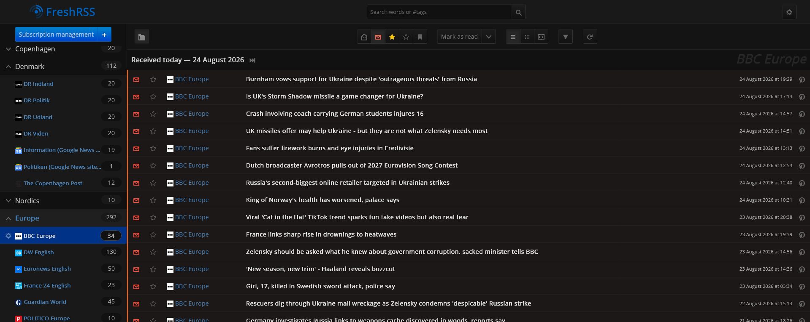
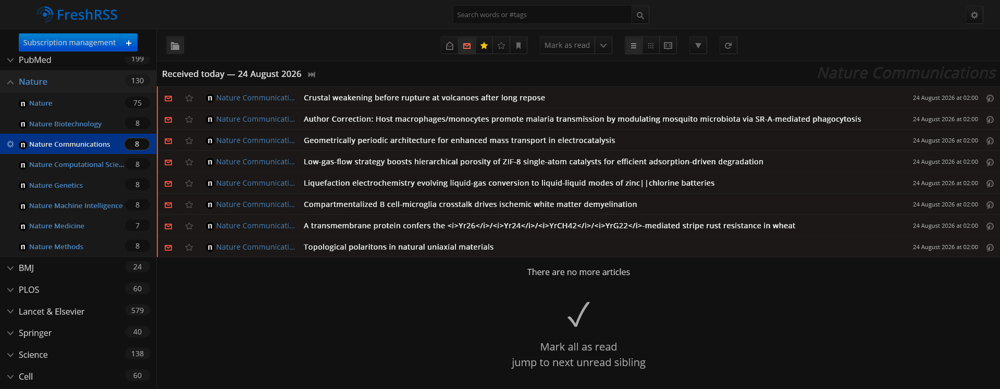
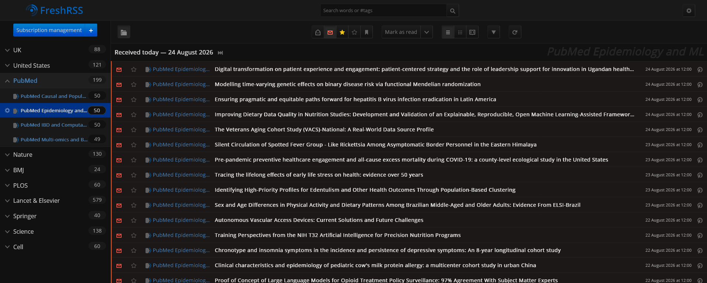

# FreshRSS Personal News & Research Feeds

A reusable setup for running **two separate FreshRSS instances locally**:

- **News** → `http://localhost:8080`
- **Research** → `http://localhost:8081`

Both instances run through Docker, use separate persistent data directories, and update automatically once per hour.

The repository is designed so that users can choose the subscriptions they want by importing the provided OPML files.

## Repository contents

```text
freshrss-feeds/
├── README.md
├── LICENSE
├── .gitignore
├── CHANGELOG.md
├── docs/
│   ├── news-setup.md
│   ├── research-setup.md
│   └── sources.md
├── images/
│   ├── example_news1.png
│   ├── example_research1.png
│   └── example_research2.png
└── opml/
    ├── freshrss-news.opml
    ├── freshrss-research.opml
    └── freshrss-all.opml
```

The recommended setup uses **`freshrss-news.opml` and `freshrss-research.opml` separately**, one for each FreshRSS instance. The combined OPML is retained as an optional export, but is not used by the recommended setup.

## What the setup provides

### News

The News instance contains feeds for:

- international/world news
- European news
- Danish news
- Nordic news
- UK news
- optional local/regional news

See:

[`docs/news-setup.md`](docs/news-setup.md)

### Research

The Research instance contains:

- direct journal RSS/Atom feeds
- PubMed journal feeds
- PubMed topic searches

See:

[`docs/research-setup.md`](docs/research-setup.md)

## Architecture

```text
Docker Compose
│
├── freshrss-news
│   ├── localhost:8080
│   └── news-data/
│
└── freshrss-research
    ├── localhost:8081
    └── research-data/
```

This gives News and Research completely separate FreshRSS databases, subscriptions, categories, settings, and article state.

## Quick start

1. Install Docker:
   - Docker Desktop on Windows or macOS
   - Docker Engine + Docker Compose on Linux
2. Create a FreshRSS project directory.
3. Create the two-service `compose.yml` described in the relevant setup guide.
4. Start both containers with:
   `docker compose up -d`
5. Open:
   - News: `http://localhost:8080`
   - Research: `http://localhost:8081`
6. Complete the FreshRSS setup separately for each instance.
7. Import:
   - `opml/freshrss-news.opml` into News
   - `opml/freshrss-research.opml` into Research
8. Refresh each instance once.
9. Both instances will update automatically once per hour.

## FreshRSS interface

### News



### Research



### Research feeds



## OPML files

### News

`opml/freshrss-news.opml`

Contains the reusable News subscription collection.

### Research

`opml/freshrss-research.opml`

Contains the reusable Research subscription collection.

### Combined

`opml/freshrss-all.opml`

Contains the News and Research subscriptions in one OPML file.

**The recommended setup in this repository does not use the combined OPML.** News and Research are intentionally kept as separate FreshRSS instances.

## Local news

The News collection intentionally keeps local news flexible.

A user can add local sources through:

- regional public broadcasters
- local newspapers
- police/public-service RSS feeds
- municipal or public-agency feeds
- Google News RSS searches when a direct RSS feed is unavailable

See [`docs/news-setup.md`](docs/news-setup.md) and [`docs/sources.md`](docs/sources.md).

## Updating the feed collection

RSS endpoints can change over time.

When a feed breaks:

1. Check the publisher's current website for an official RSS/Atom feed.
2. Prefer the first-party feed when available.
3. If a journal has no reliable RSS, consider a PubMed RSS search where appropriate.
4. Update the relevant OPML file.
5. Record the change in `CHANGELOG.md`.

 
## Running FreshRSS
From the FreshRSS project directory, start both containers using 

`docker compose up -d`

This starts both FreshRSS instances:

News     → http://localhost:8080  
Research → http://localhost:8081  

To check that both instances are running 

`docker compose ps`

To stop FreshRSS 

`docker compose down`


## Local data is not part of this repository

Do **not** commit FreshRSS runtime data, databases, users, passwords, or private reading state.

A local installation should look like:

```text
FreshRSS/
├── compose.yml
├── news-data/
├── news-extensions/
├── research-data/
└── research-extensions/
```

Only the reusable configuration, documentation, images, and OPML feed lists belong in this repository.

## License

This repository's original documentation and configuration are released under the MIT License. Third-party publisher content, names, trademarks, and feed material remain subject to their respective owners and terms.
